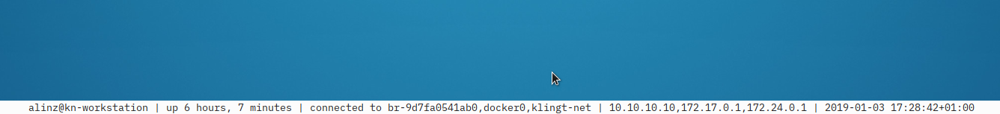

# rusty-panel (WIP)

*rusty-panel* is a simple GTK based graphical panel that shows the single line output of an arbitrary command, e.g. the output of a shell script.
An example script is shown in `./panel.sh`.

I intended to use this as an replacement for the `xfce4-panel`.
Configuration of desktop is usually done through graphical menus often and
limited by the available plugins. Since this panel is showing the ouput
a simple shell script (or whatever command you configure) it is dead
easy to customize

A default configuration will be created under `~/.config/rusty-panel.yaml` if it doesn't exist already.

